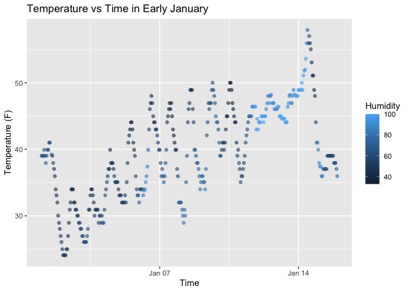

p8105_hw1_zx2528
================
Zizhi Xia
2025-09-20

# Problem 1

First, we load the dataset:

``` r
library(tidyverse)
```

    ## ── Attaching core tidyverse packages ──────────────────────────────────── tidyverse 2.0.0 ──
    ## ✔ dplyr     1.1.4     ✔ readr     2.1.5
    ## ✔ forcats   1.0.0     ✔ stringr   1.5.2
    ## ✔ ggplot2   4.0.0     ✔ tibble    3.3.0
    ## ✔ lubridate 1.9.4     ✔ tidyr     1.3.1
    ## ✔ purrr     1.1.0     
    ## ── Conflicts ────────────────────────────────────────────────────── tidyverse_conflicts() ──
    ## ✖ dplyr::filter() masks stats::filter()
    ## ✖ dplyr::lag()    masks stats::lag()
    ## ℹ Use the conflicted package (<http://conflicted.r-lib.org/>) to force all conflicts to become errors

``` r
library(moderndive)
data("early_january_weather")
```

The dataset `early_january_weather` has 358 rows and 15 columns. The
mean temperature is 39.6 degrees Fahrenheit.  
Important variables include origin, year, month, day, hour, temp, dewp,
humid, wind_dir, wind_speed, wind_gust, precip, pressure, visib,
time_hour.

``` r
ggplot(early_january_weather, aes(x = time_hour, y = temp, color = humid)) +
  geom_point(alpha = 0.6) +
  labs(
    title = "Temperature vs Time in Early January",
    x = "Time",
    y = "Temperature (F)",
    color = "Humidity"
  )
```

<!-- -->

``` r
ggsave("scatterplot_temp_time.png", width = 8, height = 6)
```

From the scatterplot, we see that temperature generally fluctuates over
time in early January, with a noticeable upward trend around
mid-January. Humidity, shown by the color scale, is typically higher
(darker blue) when temperatures are lower, and decreases as temperatures
rise.

# Problem 2

``` r
set.seed(8105)  
n <- 10

df <- tibble::tibble(
  num   = rnorm(n),                                  
  logic = num > 0,                                    
  char  = sample(letters[1:5], n, replace = TRUE),    
  fac   = factor(sample(c("low","mid","high"), n, TRUE),
                 levels = c("low","mid","high"))      
)

df
```

    ## # A tibble: 10 × 4
    ##        num logic char  fac  
    ##      <dbl> <lgl> <chr> <fct>
    ##  1  0.674  TRUE  a     low  
    ##  2  1.31   TRUE  a     mid  
    ##  3  0.115  TRUE  a     mid  
    ##  4  1.07   TRUE  c     mid  
    ##  5  0.155  TRUE  a     high 
    ##  6  2.12   TRUE  b     mid  
    ##  7 -0.219  FALSE d     low  
    ##  8 -0.113  FALSE a     high 
    ##  9 -0.0651 FALSE a     high 
    ## 10  0.476  TRUE  a     mid

``` r
library(tidyverse)

mean_num   <- df %>% pull(num)   %>% mean()
mean_logic <- df %>% pull(logic) %>% mean()
mean_char  <- try(df %>% pull(char) %>% mean(),  silent = TRUE)
```

    ## Warning in mean.default(.): argument is not numeric or logical: returning NA

``` r
mean_fac   <- try(df %>% pull(fac)  %>% mean(),  silent = TRUE)
```

    ## Warning in mean.default(.): argument is not numeric or logical: returning NA

``` r
tibble(
  variable   = c("num","logic","char","fac"),
  mean_value = c(mean_num, mean_logic, NA, NA),
  note = c(
    "OK: numeric",
    "OK: logical ",
    "ERROR: character ",
    "ERROR: factor "
  )
)
```

    ## # A tibble: 4 × 3
    ##   variable mean_value note               
    ##   <chr>         <dbl> <chr>              
    ## 1 num           0.552 "OK: numeric"      
    ## 2 logic         0.7   "OK: logical "     
    ## 3 char         NA     "ERROR: character "
    ## 4 fac          NA     "ERROR: factor "

``` r
as_num_logic <- as.numeric(df$logic)  
as_num_char  <- as.numeric(df$char)   
```

    ## Warning: NAs introduced by coercion

``` r
as_num_fac   <- as.numeric(df$fac)  
```

This exercise shows that numeric and logical variables can be
meaningfully averaged, while character and factor variables cannot.
